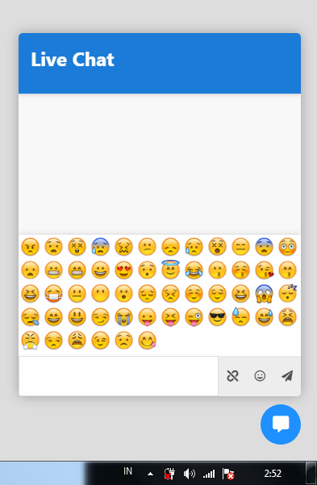

# ChatClient
beta ChatClient project

realtime chat client using websocket 

# Usage
load init file on target page

    require ( dirname(__FILE__) . "/src/init.php");
    
default socket using "echo.websocket.org"
